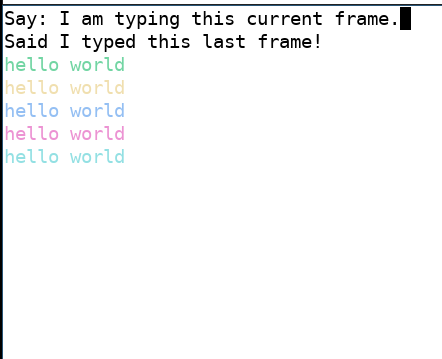
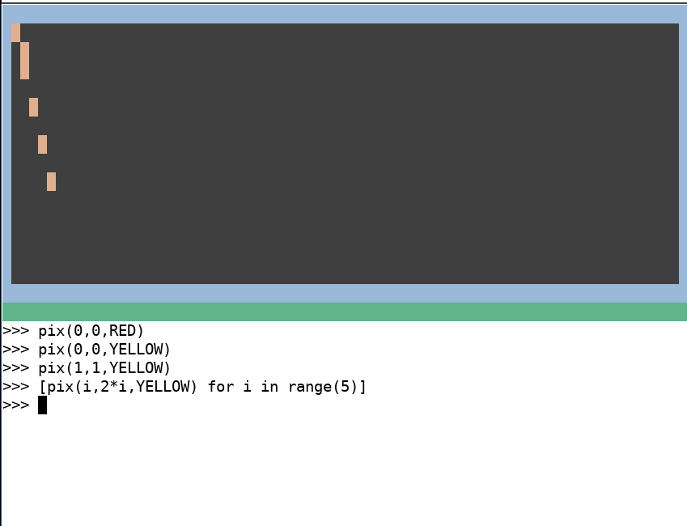
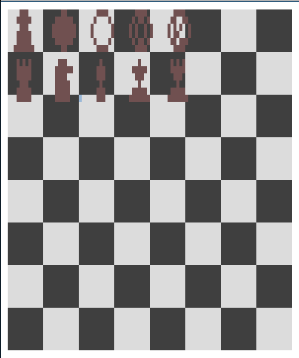

# CodePad

## Introduction

It's time again to have fun with terminal graphics.

You can clear the screen, get the window size, write text and colored pixels to arbitrary locations, and take line input.

This lib is good for making little games, demos, graphical utilities. The goal is to be easy enough to use that you can easily memorize the API ! This is for lazily typing up a prototype with your mind elsewhere on a Sunday afternoon.

## Code Walkthrough

Anyway here's how a program looks ! This is Python3+ code.

```python
from codepad import *

# This loop will be present in just about any interactive CodePad program.
# It manages user input, and the funny name stands for "Prompt Loop"
while ploop():

    # clears the terminal screen
    clear()

    # collects the window size in columns (W) and rows (H)
    W,H = size()

    for i in range(8):
        
        # see documentation.txt for more info on how color works
        # for now, know that it will meet all of your color needs!

        # set text color to bright `i-color`
        # the colors are numbered black=0, red=1, green=2, up to white=7
        color(fg+brite+i)

        # set the background color to the default
        # (this isn't strictly necessary)
        color(bg+reset)

        # print the text with the foreground color
        # then produces a newline.
        write("hello world"); nl()

    # move the cursor back towards the top left of the screen
    # the cursor location is where the subsequent `write` will occur
    cursor(0,1)

    # prompt() gets the user input (collected by ploop)
    # It is set to "" for the first frame
    write("Said " + prompt())

    # now we move to the true top-left corner
    # importantly, the last location of the cursor
    # is where the user prompt will show up
    cursor(0,0)

    # The `write` command will push the cursor to the end of the 
    # string, and the user can type after the end of "Say :"
    write("Say: ")

# ploop terminates when the user presses Ctrl-C or Ctrl-D

# We should move the cursor down so the incoming shell prompt does
# not collide with the previous ui/illustrations.
W,H = size()
cursor(0, H-1)
```

## Quick Reference

```
COLORS

black = 0   red = 1       green = 2   yellow = 3   
blue = 4    magenta = 5   cyan = 6    white = 7   reset = 8

GRAPHICS CALLS

clear()                      clear the screen

color(bg+blue)               set character background color blue
color(fg+brite+black)        set character text color to gray

cursor(3,4)                  move cursor to x,y coordinate 3,4

write("mystring")            writes "mystring" with set colors
                             at set cursor location
                             moves cursor to end of string

nl()                         produces an uncolored newline

pix(3,4, blue)               for drawing, this sets the bg
                             blue at the location 3,4. The character
                             is blank, allowing for terminal cells
                             to be used like pixels.

INPUT CALLS

prompt()                     get user input string
size()                       get terminal size (cols, lines)

ADVANCED

call('2J')                   send an ANSI escape sequence
                             this example '2J' clears the terminal

place(-3,4,"Wow\0\0cool")    A more advanced version of `write`.
                             Currently untested, and probably
                             not completed.

                             See documentation.txt for information
                             about the special features of `place`.

```

## Screenshots

### codepad demo


### codepad shell


### chesskers

